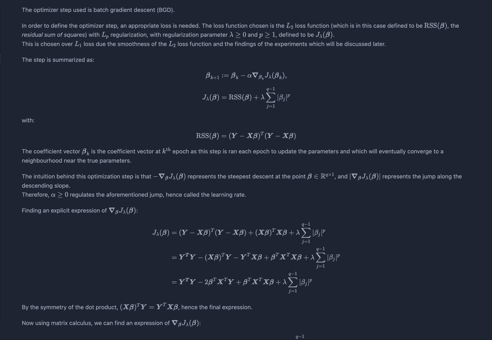
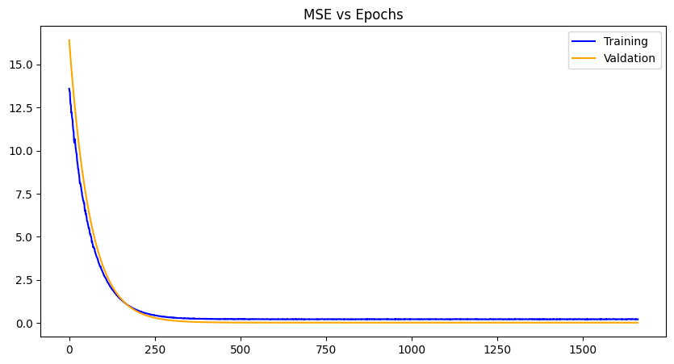

# The Calculus of First-Order Gradient-Based Machine Learning

## Overview

This project explores the calculus foundations of machine learning using linear regression in JAX, but with gradients analytically derived and manually computed. The effects of advanced techniques are explored like *Lp-regularization*, *dropout*, *early stopping* and different weight-initialization methods like He, LeCun, random and zero. This project also exposes the need for advanced first-order gradient methods, like momentum, RMS propagation, Adagrad, Adam and so on.

## The Model 

## The Optimization

## Structuring the Model

I employ Object-Oriented Programming, to keep the syntax analogous to scikit-learn. However, it is more flexible as it allows many more parameters that can adjust many regularization techniques, both explicit and implicit. Regularization techniques are used to prevent overfitting, which is often a result of the model memorizing the training data, rather than learning generalized patterns. This leads to very high performance on the training data but poor performance on unseen data i.e. validation and test data. Therefore, the techniques solve this by reducing the complexity of the model artificially to avoid learning the noise and improving generalization.

The class is called `LinearRegressionModel` with contains the following adjustable initialized attributes:
- `weights_init` - A string that allows the options of picking zero, random, Xavier, LeCun or He initialization for $\boldsymbol{\beta}_0$. For more information, check the following website:
[A Gentle Introduction To Weight Initialization for Neural Networks](https://wandb.ai/sauravmaheshkar/initialization/reports/A-Gentle-Introduction-To-Weight-Initialization-for-Neural-Networks--Vmlldzo2ODExMTg).
- `epochs` - Number of epochs.
- `learning_rate` - the learning rate, $\alpha$.
- `p` - Indicates which $L_p$ norm used in the explicit regularization technique. Does not include $L_{\infty}$.
- `lambda_` - The regularization coefficient, $\lambda$.
- `max_patience` - The maximum amount of epochs that can run if the loss on the validation data does not improve significantly.
- `dropout` - The expected proportion of zeroed feature data points. It's modelled as a multivariate Bernoulli variable of size $n$ with probability $(1-$`dropout`$)$.  
This can be important for reducing 
- `random_state` - The random seed.

The class also have the following methods:
- `fit` - Takes in the training data and validation data (optional) and trains the parameters on the data. Nothing is returned.
- `predict` - Only takes in the testing feature data `X_test` to predict the test labels.
- `plot_losses` - No arguments. Outputs the graph of training losses and validation losses on the same graph using the trained parameters. Therefore, this method is best used after fitting the model using `fit`.

## Experimentation

I have used three datasets from Kaggle as part of the experiment:
- [Student Performance (Multiple Linear Regression)](https://www.kaggle.com/datasets/nikhil7280/student-performance-multiple-linear-regression)
- [Multiple Linear Regression Dataset](https://www.kaggle.com/datasets/hussainnasirkhan/multiple-linear-regression-dataset)
- [US Health Insurance Dataset](https://www.kaggle.com/datasets/teertha/ushealthinsurancedataset)

### Data Preprocessing

Three steps were taken when preprocessing data:
- one-hot encoding,
- normalizing,
- and splitting the data.

One-hot encoding was done first to make sure the `object`-type columns are represented numerically before normalizing the data. Normalizing the data was done by subtracting each data point by the mean of the column then dividing by the standard deviation of the same column. This ensures each column is of mean 0 and variance 1. This is necessary because if not normalized, the optimizer step becomes more sensitive to changes in the hyperparameters. Such is a problem because it would either lead to divergence or very slow learning to ensure convergence. Splitting the data is the standard procedure in retrieving the training, validation and testing data. The split chosen was 72% training, 8% validation and 20% testing, but these are hyperparameters which are subject to personal preference. The dataset I used for evaluation, diagnosis and configure the hyperparameters in `config.py` is [Student Performance (Multiple Linear Regression)](https://www.kaggle.com/datasets/nikhil7280/student-performance-multiple-linear-regression), and I ran the other .csv files to make sure that this code (hopefully) works on other unseen custom datasets. With the specific configurations of the hyperparameters in `config.py` I was able to beat the performance of scikit-learn's built-in `sklearn.linear_model.LinearRegression` model on the test set of the aforementioned custom dataset.

### Testing the Assumption of Proposed Model

To see if the assumption of the proposed model was reasonable we need to look at the claims made:
- *Linearity* - The expected value of $\boldsymbol{Y}$ given $\boldsymbol{X}$ is linear. More specifically: $\text{E}(\boldsymbol{Y|X})=\boldsymbol{X\beta}$.
- *Normality of errors* - For each data point, $\epsilon_i \sim N(0,\sigma^2)$.
- *Independence of errors* - All errors are assumed to be i.i.d. or equivalently: $\text{Cov}(\epsilon_i,\epsilon_j)=0$ if $i \ne j$.
- *Homoscedasticity* - The errors have constant variance $\sigma^2$.
- *Full-Rank Design Matrix* - The design matrix $\boldsymbol{X}$ is of full rank. It is reasonable to assume full rank because a design matrix that is not full rank would contain a feature of the data that is simply a reflection of another feature(s) of the data. Mathematically, it would mean that at least one of the columns of the design matrix is a linear combination of the other columns in that same matrix.

A useful way to check the above assumptions of the model, is by looking at the following diagnostic plots:

 

***Residual vs Fitted Values***:

If the model assumptions are correct, it is expected that the plot displays an even spread of points with $\text{E}(\boldsymbol{e})=\text{E}(\boldsymbol{Y}) - \text{E}(\boldsymbol{\hat{Y}}) = \boldsymbol{X\beta} - \boldsymbol{PX\beta} = 0$.

Looking at the plot, it seems that it affirms the assumptions made about the model of the data, as it shows an uncorrelated, even spread of points with $y$ = 0.  
Moreover, the red line shows that there is no underlying non-linearity hidden within the residuals, therefore supporting the assumption of *linearity*.

***Normal Q-Q Plots***:

The Normal Q-Q plots compares the quantiles of the residuals with the quantiles of an appropriate Normal distribution, thus clearly indicating if the assumption of *normality of errors*.

The plot above is not against the standard $N(0,1)$ distribution but instead against $N(0, \text{Var}(\boldsymbol{e}))$, with $\text{Var}(\boldsymbol{e}) = \boldsymbol{Q}\text{Var}(\boldsymbol{Y})\boldsymbol{Q}^T= \sigma^2\boldsymbol{QQ}^T = \sigma^2\boldsymbol{Q}$, where $\boldsymbol{Q} = \boldsymbol{I} - \boldsymbol{P}$. 
One can show that $\boldsymbol{Q}$ is also idempotent and symmetric.

This is because we should expect that the residuals should have mean $0$, however the model assumption is that the errors have constant variance $\sigma^2$ but not necessarily that it is equal to 1.

If the plot was against the standard Normal distribution, then the plot would show the same blue line but at with a different slope, so the scaled distribution is used to clearly show the Normality of the residuals.

***Scale-Location Plot***:

This plot makes it easier to discern if the assumption of *homoscedasticity* is valid. 
Similar to the first plot, the square-root standardized residuals (SRSR) are plotted against the fitted values. 
This is preferred to check *homoscedasticity* over the first plot because it scales the residuals to have variance $1$ before taking the square-root, and this leads a significantly easier interpretation of the assumption.

The SRSR takes the form:
$$\bar{e}_i = \sqrt{\frac{e_i}{\text{Var}(e_i)}}, \quad i \in \{1,2,...,n\}$$ 

The scale-location plot looks standard given our assumptions. Even spread with a straight red line, showing no underlying non-linearity and just reinforces what was found in the *residual vs fitted values plot*.

***Residuals vs Leverage***:

### Analysis of the coefficient vector, $\boldsymbol{\beta}$

Looking at the coefficient vector $\boldsymbol{\beta}$ that beat scikit-learn's implementation of the model, the output of the parameters came out to be: 
`(Array([-8.7041764e-05,  3.8404137e-01,  9.1835845e-01,  1.6454296e-02,
         4.1350484e-02,  2.8759979e-02], dtype=float32))`, 
with the very first parameter referring to $\beta_0$, the bias. 
For reference, the columns associated with each parameter is: 
$\beta_0$, `Hours Studied', 'Previous Scores', 'Extracurricular Activities',
        'Sleep Hours', 'Sample Question Papers Practiced'`.

At first glance, $\beta_0$ is really the only coefficient that is substantially smaller compared to the rest of the parameters $\beta_i$. 

This suggests that the bias is not necessary in the model for this data ([Student Performance (Multiple Linear Regression)](https://www.kaggle.com/datasets/nikhil7280/student-performance-multiple-linear-regression)), yet the all the columns in said data seems to be important in predicting the label.

Furthermore, using R, we can output a summary of statistics of the coefficients in the model: 

Looking at the p-values, in the column `Pr(>|t|)`, we can see that every coefficients at each column are statistically significant with very low p-values except for `(Intercept)` and `Extracurricular.Activities_Yes`. 

This corresponds with the findings of the weights through the model proposed using *JAX*, except for `Extracurricular Activites`. The weight associated with the feature was indeed the second smallest, but similar in magnitude with the other statistically significant weights.

This indicates that out of all the features used, the extracurricular activities the students engage in is not influential in achieving good grades.  

### Results

<table>
<tr>
        <td>
Zero Initialization
</td>
        <td>
Random Initialization
</td>
</tr>
        <td>
He Initialization
</td>
        <td>
Xavier Initialization
</td>
        <td>
LeCun Initialization
</td>
</table>

For each weight initialization, the training and the validation losses decrease with each epoch until convergence, as expected. The random weight initialization did best overall, most likely because of the simplicity of the model and chance. The other plots demonstrate a zig-zag pattern with the training losses, which can be mitigated with a different optimizer algorithm like gradient-descent with momentum, RMS propagation, Adam etc. Issues with exploding gradients did occur with this project and was worked around using normalization of the data. However, techniques like gradient norm clipping can also work around it especially paired with a different optimization algorithm. Other losses can be used as well like RMSE (root mean squared error), SSE (sum of squared errors) and the like, to see any improvements in data you wish to use.
